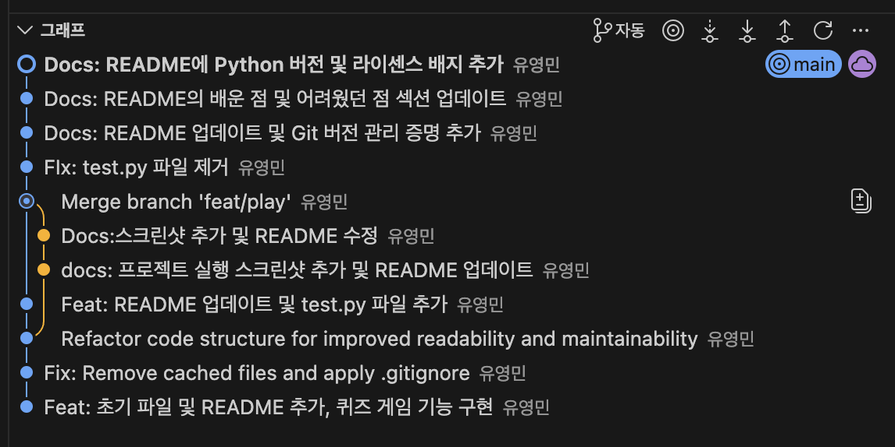
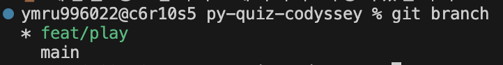
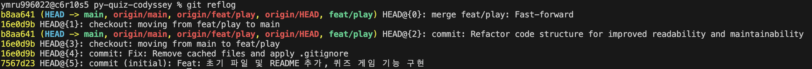
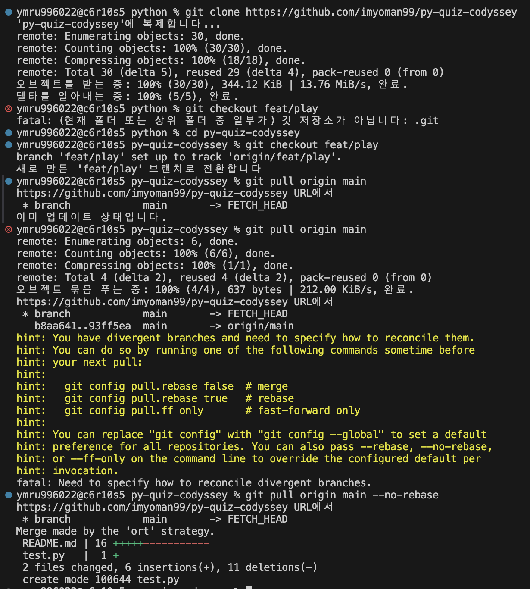
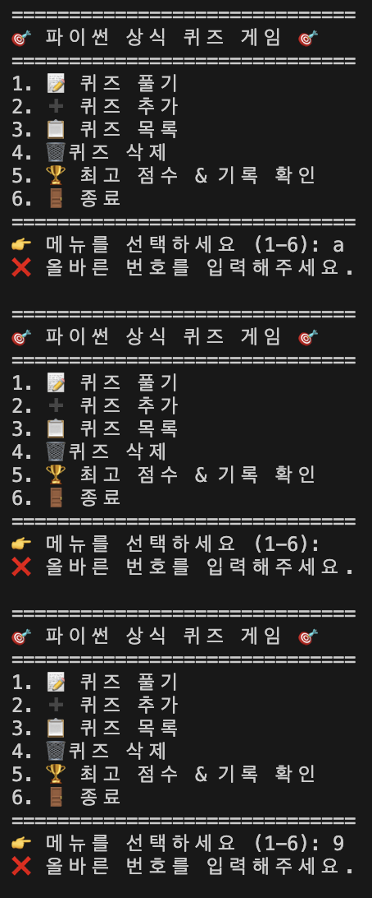
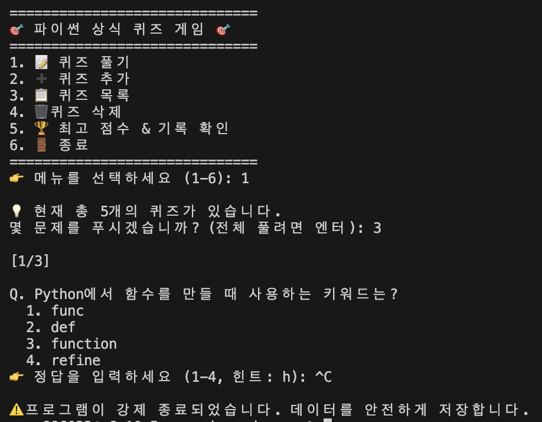
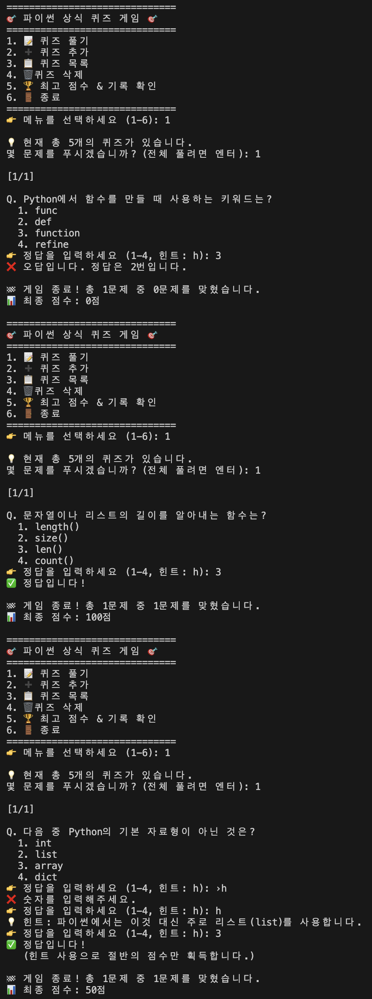
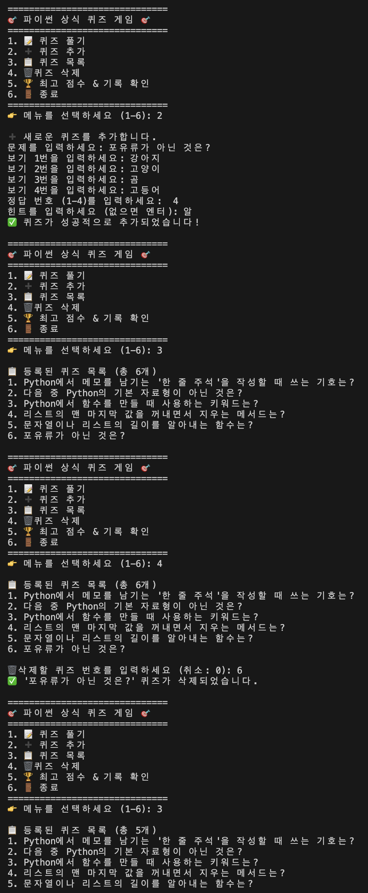
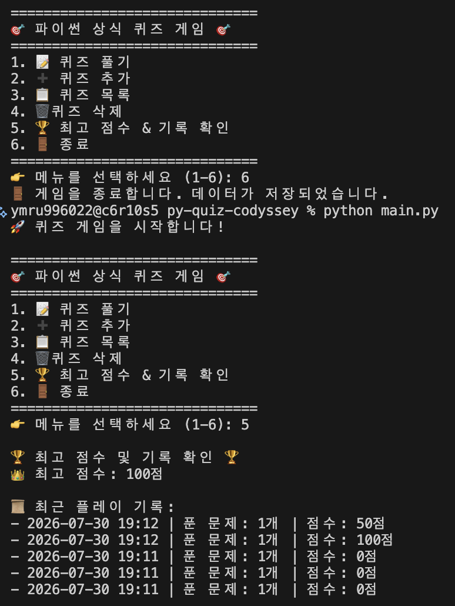

# 🎯 나만의 퀴즈 게임 (Python Quiz Game)


> 퀴즈로 재미있게 마스터하는 파이썬 기초 문법 챌린지! 퀴즈를 직접 추가하고, 최고 점수에 도전하세요.

---

## 📌 목차
1. [프로젝트 개요](#1-프로젝트-개요)
2. [퀴즈 주제와 선정 이유](#2-퀴즈-주제와-선정-이유)
3. [실행 방법](#3-실행-방법)
4. [기능 목록](#4-기능-목록)
5. [실행 화면 및 핵심 요구사항 증명](#5-실행-화면-및-핵심-요구사항-증명)
6. [파일 구조](#6-파일-구조)
7. [데이터 파일 설명 (state.json)](#7-데이터-파일-설명-statejson)
8. [코드 구조 (클래스 설계)](#8-코드-구조-클래스-설계)
9. [Git 워크플로우](#9-git-워크플로우)
10. [개발 환경](#10-개발-환경)
11. [배운 점 & 어려웠던 점](#11-배운-점--어려웠던-점)

---

## 1. 프로젝트 개요
- 터미널(콘솔)에서 동작하는 4지선다 퀴즈 게임입니다.
- Python 기본 문법과 클래스(객체 지향)로 구현했으며, 외부 라이브러리 없이 표준 라이브러리만 사용했습니다.
- 퀴즈와 최고 점수를 `state.json` 파일에 저장하여, 프로그램을 종료해도 데이터가 유지됩니다.
- Git으로 기능 단위 커밋과 브랜치 병합을 경험하며 개발 과정을 기록했습니다.

**개발 기간**: 2026.07.29 ~ 2026.07.30

---

## 2. 퀴즈 주제와 선정 이유

**주제**: 파이썬 기초 문법 퀴즈 게임

**선정 이유**:
파이썬 기초 문법을 단순히 책으로 공부하는 것보다 직접 퀴즈를 풀며 재미있게 익히면 좋겠다고 생각했습니다. 정답을 맞추는 성취감과 함께 부족한 개념을 자연스럽게 보완하며 탄탄한 실력을 다질 수 있어서 이 주제를 선택했습니다.

---

## 3. 실행 방법

### 요구 사항
- Python 3.10 이상
- 외부 라이브러리 설치 불필요 (표준 라이브러리만 사용)

### 실행
```bash
# 1. 저장소 복제
git clone https://github.com/imyoman99/py-quiz-codyssey.git

# 2. 디렉터리 이동
cd py-quiz-codyssey

# 3. 실행
python main.py
```

> 💡 첫 실행 시 `state.json`이 없으면 기본 퀴즈 5개로 자동 시작됩니다.

---

## 4. 기능 목록

### 필수 기능
| 번호 | 기능 | 설명 |
|:---:|------|------|
| 1 | 📝 퀴즈 풀기 | 저장된 퀴즈를 출제하고 정답/오답을 판정, 결과 표시 |
| 2 | ➕ 퀴즈 추가 | 문제·선택지 4개·정답 번호를 입력받아 저장 |
| 3 | 📋 퀴즈 목록 | 등록된 전체 퀴즈 확인 |
| 4 | 🏆 점수 확인 | 최고 점수 확인 (풀 때마다 자동 갱신·저장) |
| 5 | 🚪 종료 | 데이터 저장 후 안전하게 종료 |

### 보너스 기능 (구현 완료 ✅)
| 기능 | 설명 |
|------|------|
| 🎲 랜덤 출제 | `random.shuffle`로 문제 순서를 섞어 출제 |
| 🔢 문제 수 선택 | 풀 문제 개수를 사용자가 선택 가능 |
| 💡 힌트 기능 | 힌트 확인 가능, 사용 시 점수 차감 |
| 🗑️ 퀴즈 삭제 | 등록된 퀴즈 삭제 후 파일에 반영 |
| 📜 점수 히스토리 | 날짜/시간·푼 문제 수·점수를 모두 기록 |

### 예외 처리
- 공백 포함 입력 → 앞뒤 공백 제거 후 처리
- 숫자가 아닌 입력(`abc`) / 범위 밖 숫자(`9`) / 빈 입력 → 안내 후 재입력
- `Ctrl+C`, `EOF` 발생 시 → 데이터 저장 후 안전 종료
- `state.json` 없음/손상 시 → 기본 퀴즈 데이터로 실행

---

## 5. 실행 화면 및 핵심 요구사항 증명

단순한 기능 구현을 넘어, 예외 처리와 데이터 영속성, 그리고 Git을 활용한 버전 관리 과정을 증명합니다.

---

### 5-1. Git 버전 관리 및 브랜치 전략 증명
> 기능 단위 작업과 브랜치 병합, 원격 저장소 동기화 과정을 기록했습니다.

* **[10회 이상 커밋 증명]**
  VS Code를 통해 확인한 10회 이상의 의미 있는 커밋 내역입니다.
  <br>
  
  <br><br>

* **[브랜치 생성 및 분리]**
  `main` 브랜치에서 `feat/play` 등 기능 브랜치를 생성하고 이동한 화면 (`git branch` 확인 캡처)
  <br>
  
  <br><br>

* **[커밋 및 병합 히스토리]**
  브랜치 작업 후 `main`으로 병합(Merge)한 내역 (`git reflog` 터미널 캡처)
  <br>
  
  <br><br>

* **[Clone & Pull 실습]**
  로컬 저장소를 별도로 Clone하고, 변경 사항을 Pull로 성공적으로 가져온 화면
  <br>
  
  <br><br>

---

### 5-2. 핵심 예외 처리 및 방어적 프로그래밍
> 사용자의 잘못된 입력이나 돌발 상황에서도 프로그램이 비정상 종료되지 않도록 처리했습니다.

* **[입력 오류 방어]**
  메뉴나 정답 입력 시 숫자가 아닌 문자(`abc`), 빈 엔터(공백), 범위 밖의 숫자(`9`)를 입력했을 때 다시 입력을 유도하는 화면
  <br>
  
  <br><br>

* **[강제 종료(Ctrl+C) 방어]**
  실행 중 `Ctrl+C`를 눌렀을 때 에러를 뿜으며 튕기지 않고, "데이터를 안전하게 저장합니다" 메시지와 함께 정상 종료되는 화면
  <br>
  
  <br><br>

---

### 5-3. 퀴즈 게임 주요 기능
> 요구사항과 보너스 과제(힌트, 랜덤 출제 등)를 적용한 실제 플레이 화면입니다.

* **[문제 출제 및 힌트 사용]**
  랜덤으로 섞인 퀴즈가 출제되고, `h`를 눌러 힌트를 확인한 뒤 점수가 차감(또는 차등 부여)되는 것을 보여주는 화면
  <br>
  
  <br><br>

* **[퀴즈 추가 및 삭제]**
  새로운 퀴즈를 직접 추가하고, 목록에서 번호를 선택해 삭제하는 흐름
  <br>
  
  <br><br>

---

### 5-4. 데이터 영속성 (Data Persistence) 증명
> 프로그램 종료 후 재실행해도 데이터가 날아가지 않는 것을 증명합니다.

* **[재실행 시 데이터 유지]**
  게임을 종료했다가 다시 실행한 직후, `5. 점수 확인` 메뉴를 눌러 이전 플레이 기록과 최고 점수가 그대로 남아있는 화면
  <br>
  
  <br><br>

---

## 6. 파일 구조

```text
py-quiz-game/
├── main.py              # 프로그램 진입점 (QuizGame 실행)
├── quiz.py              # Quiz 클래스 (개별 퀴즈)      
├── quiz_game.py         # QuizGame 클래스 (게임 관리)
├── state.json           # 데이터 저장 파일 (자동 생성)
├── README.md            # 프로젝트 설명 문서
├── .gitignore           # Git 제외 파일 설정
└── docs/
    └── screenshots/     # 실행 화면 및 개발 과정 증명 스크린샷
        ├── vscode_commits.png   # 10회 이상 커밋 내역 증명 (추가)
        ├── git_branch.png       # 브랜치 생성 및 분리 확인
        ├── git_log.png          # 커밋 및 병합(Merge) 기록
        ├── git_pull.png         # Clone 및 Pull 실습 확인
        ├── error_input.png      # 잘못된 입력(문자, 범위 밖) 예외 처리
        ├── error_ctrl_c.png     # 강제 종료(Ctrl+C) 방어 및 안전 종료
        ├── play_hint.png        # 퀴즈 출제 및 힌트 사용(점수 차감) 화면
        ├── add_delete.png       # 새로운 퀴즈 추가 및 삭제 화면
        └── data_persistence.png # 재실행 시 데이터 유지 및 최고 점수 확인

---

## 7. 데이터 파일 설명 (state.json)

| 항목 | 내용 |
|------|------|
| **경로** | 프로젝트 루트 `./state.json` |
| **역할** | 퀴즈 목록과 최고 점수를 저장하여 재실행 시에도 데이터 유지 |
| **인코딩** | UTF-8 |
| **생성 시점** | 첫 저장 시 자동 생성 (없으면 기본 퀴즈로 시작) |

### 스키마

```json
{
    "quizzes": [
        {
            "question": "문자열이나 리스트의 길이를 알아내는 함수는?",
            "choices": [
                "length()",
                "size()",
                "len()",
                "count()"
            ],
            "answer": 3,
            "hint": "길이를 뜻하는 영어 단어와 연관입니다."
        }
    ],
    "best_score": 0,
    "history": []
}
```

| 필드 | 타입 | 설명 |
|------|------|------|
| `quizzes` | list | 퀴즈 객체 목록 |
| `quizzes[].question` | str | 문제 내용 |
| `quizzes[].choices` | list | 선택지 4개 |
| `quizzes[].answer` | int | 정답 번호 (1~4) |
| `quizzes[].hint` | str | 힌트 (보너스) 
| `best_score` | int | 최고 점수 |
| `history` | list | 게임 기록 (보너스) 

---

## 8. 코드 구조 (클래스 설계)

### `Quiz` — 개별 퀴즈를 표현
| 구분 | 이름 | 역할 |
|------|------|------|
| 속성 | `question` | 문제 내용 |
| 속성 | `choices` | 선택지 4개 리스트 |
| 속성 | `answer` | 정답 번호 (1~4) |
| 속성 | `hint` | 퀴즈 힌트 (보너스 기능) |
| 메서드 | `display()` | 문제와 선택지 출력 |
| 메서드 | `check(user_answer)` | 정답 여부 반환 (True/False) |
| 메서드 | `to_dict()` | JSON 저장을 위해 객체를 dict 형태로 변환 |
| 메서드 | `from_dict(cls, data)` | dict 데이터로부터 Quiz 객체를 생성하는 클래스 메서드 |

### `QuizGame` — 게임 전체를 관리
| 구분 | 이름 | 역할 |
|------|------|------|
| 속성 | `quizzes` | Quiz 객체 목록 |
| 속성 | `best_score` | 최고 점수 |
| 속성 | `history` | 플레이 기록 (날짜, 문제 수, 점수) 리스트 |
| 메서드 | `run()` | 메인 루프 실행 (메뉴 → 기능 분기, 예외 처리) |
| 메서드 | `show_menu()` | 메뉴 출력 |
| 메서드 | `play_quiz()` | 퀴즈 출제·채점(힌트 차감 포함)·결과 표시 |
| 메서드 | `add_quiz()` | 새 퀴즈 입력받아 등록 |
| 메서드 | `delete_quiz()` | 등록된 퀴즈 삭제 |
| 메서드 | `show_list()` | 퀴즈 목록 출력 |
| 메서드 | `show_score()` | 최고 점수 및 플레이 기록 확인 |
| 메서드 | `save_state()` | state.json에 데이터 저장 |
| 메서드 | `load_state()` | state.json에서 불러오기 (없음/손상 처리 포함) |
| 메서드 | `set_default_quizzes()`| 파일이 없거나 손상되었을 때 기본 퀴즈 데이터 세팅 |


### 클래스 관계
```
main.py
  └── QuizGame (게임 관리자)
        ├── Quiz 객체 여러 개를 quizzes 리스트로 보유
        └── state.json 저장/불러오기 담당
```

> 💡 설계 의도: **Quiz는 "퀴즈 1개"만 알고, QuizGame은 "게임 진행"만 안다.**
> 역할을 분리하면 코드를 수정할 때 어디를 고쳐야 할지 명확해집니다.

---

## 9. Git 워크플로우

### 커밋 컨벤션
| 태그 | 의미 | 예시 |
|------|------|------|
| `Feat` | 기능 추가 | Feat: 퀴즈 출제 기능 구현 |
| `Fix` | 버그 수정 | Fix: 점수 계산 오류 수정 |
| `Docs` | 문서 작성 | Docs: README 실행 방법 추가 |
| `Refactor` | 구조 개선 | Refactor: QuizGame 책임 분리 |

### 브랜치 전략
```
main ──●──●──●──────────●──●──●──  (안정 버전)
             \          /
   feat/play  ●──●──●──   (기능 추가 및 제거 후 병합)
```

| 브랜치 | 용도 |
|--------|------|
| `main` | 완성된 기능만 병합하는 기본 브랜치 |
| `feat/play` | 퀴즈 풀기 기능 개발 브랜치 |

### 커밋 히스토리

```
* b8aa641 (HEAD -> main, origin/main, origin/feat/play, origin/HEAD, feat/play) Refactor code structure for improved readability and maintainability
* 16e0d9b Fix: Remove cached files and apply .gitignore
* 7567d23 Feat: 초기 파일 및 README 추가, 퀴즈 게임 기능 구현
```

### Git 명령어 (7종)
| 명령어 | 사용 상황 |
|--------|-----------|
| `init` | 로컬 저장소 초기화 
| `add` | 변경 파일을 스테이징 영역에 추가 |
| `commit` | 기능 단위로 변경 이력 기록 |
| `push` | 로컬 커밋을 GitHub 원격 저장소에 업로드 |
| `checkout` | `feat/play` 브랜치 생성 및 이동 |
| `clone` | 완성 후 별도 디렉터리에 저장소 복제 실습 |
| `pull` | 복제본에서 push한 변경사항을 원본 디렉터리로 가져옴 |

---

## 10. 개발 환경
| 항목 | 내용 |
|------|------|
| 언어 | Python 3.12.13 |
| 에디터 | VSCode |
| OS |  macOS | 
| 버전 관리 | Git / GitHub |
| 외부 라이브러리 | 없음 (표준 라이브러리 `json`, `random`, `datetime`만 사용) |

---

## 11. 배운 점 & 어려웠던 점

### 💡 배운 점

*   **클래스 설계와 역할 분리 (OOP)**
    처음에는 함수 위주로만 생각했으나, 개별 퀴즈 데이터를 담당하는 `Quiz` 클래스와 전체 게임 흐름을 관리하는 `QuizGame` 클래스로 나누어 구현해 보았습니다. 각 클래스가 맡은 역할(책임)이 분리되니 코드를 읽기도 편해지고, 나중에 힌트 기능 등 새로운 기능을 추가할 때 어디를 수정해야 할지 명확해져 유지보수가 훨씬 쉬워짐을 느꼈습니다.
*   **데이터 영속성(Persistence)의 이해**
    변수에 담긴 데이터는 프로그램이 종료되면 날아간다는 한계를 체감했습니다. 이를 해결하기 위해 내장 `json` 모듈을 활용해 데이터를 파일(`state.json`)로 저장하고 불러오는 과정을 직접 구현하며, 파일 I/O와 데이터 영속성의 개념을 확실히 이해할 수 있었습니다.
*   **Git 브랜치를 활용한 안전한 개발**
    새로운 기능을 추가할 때 기존 코드가 망가질까 두려웠는데, 안정적인 `main` 브랜치를 두고 새로운 브랜치(예: `feat/play`)를 파서 작업하는 방식의 장점을 깨달았습니다. 브랜치를 활용하니 메인 코드에 영향을 주지 않고 마음껏 코드를 수정하고 실험할 수 있었습니다.

### 🧗 어려웠던 점 & 해결 과정

*   **외부 요인에 의한 데이터 파일 손상 문제**
    *   **문제:** 테스트 중 `state.json` 파일 안의 텍스트가 지워지거나 문법이 깨졌을 때, 프로그램이 데이터를 읽어오지 못하고 에러를 뿜으며 뻗어버리는 현상이 발생했습니다.
    *   **해결:** `load_state()` 메서드에 `try-except` 구문을 추가하여 `json.JSONDecodeError` 등의 예외를 잡았습니다. 에러 발생 시 사용자에게 안내 메시지를 출력하고, 내장된 **기본 퀴즈 데이터로 안전하게 복구 및 덮어쓰도록(방어적 프로그래밍)** 처리하여 프로그램이 절대 비정상 종료되지 않게 해결했습니다.
*   **사용자의 강제 종료(Ctrl+C) 시 데이터 유실 문제**
    *   **문제:** 게임 플레이 도중 사용자가 터미널에서 `Ctrl+C`를 누르거나 입력 스트림이 끊기면(EOF), 게임 진행 상황이나 갱신된 최고 점수가 저장되지 않고 그대로 프로그램이 강제 종료되었습니다.
    *   **해결:** 메인 루프인 `run()` 메서드 전체를 `try-except (KeyboardInterrupt, EOFError)`로 감싸서 사용자의 강제 종료 시도를 감지했습니다. 강제 종료 시에도 "데이터를 안전하게 저장합니다"라는 안내와 함께 `self.save_state()`가 반드시 호출된 후 종료되도록 로직을 개선했습니다.
*   **예측할 수 없는 사용자 입력 처리**
    *   **문제:** 정답 번호를 입력받을 때 그냥 엔터(빈 값)를 치거나 문자를 입력하면 프로그램이 오작동하는 경우가 있었습니다.
    *   **해결:** `while True` 루프와 `.strip()` 메서드를 활용하여, 입력값의 공백을 제거하고 숫자로 변환 가능한지, 그리고 범위(1~4) 안에 있는지 철저히 검증했습니다. 잘못된 입력일 경우 적절한 경고 메시지를 띄우고 다시 입력을 유도하는 무한 루프를 만들어 사용성을 높였습니다.